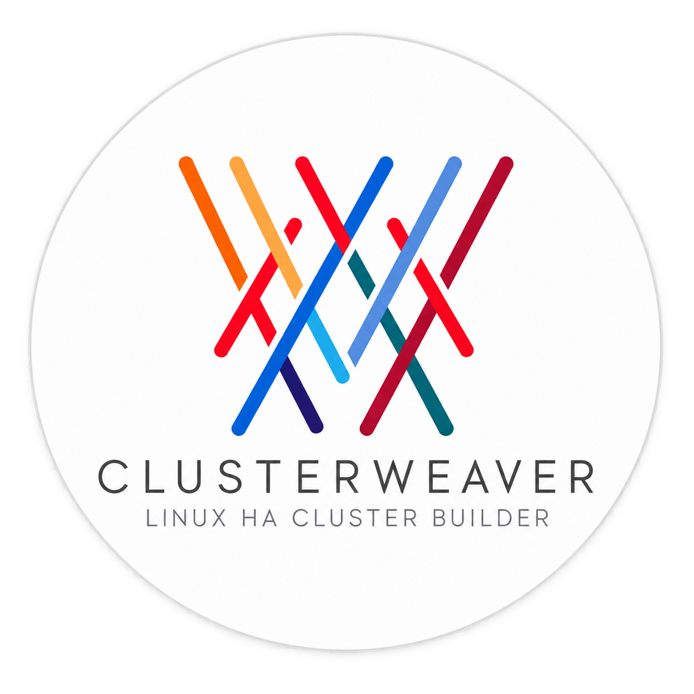

# ClusterWeaver

<p align="center">
  
</p>

[](LICENSE)

Linux High Availability Cluster Builder & Lifecycle Manager.

Current release: **0.1.6**. Release history is maintained in `CHANGELOG.md` and is also available from the Changelog link in the web interface.

ClusterWeaver is free software licensed under the [GNU Affero General Public License v3.0](LICENSE). Modified versions offered to users over a network must make their corresponding source available under the same license. Contributions are welcome; see [CONTRIBUTING.md](CONTRIBUTING.md) and [SECURITY.md](SECURITY.md).

This first MVP manages RHEL 7, 9, and 10 cluster projects and nodes. It stores searchable state in SQLite, writes a human-readable YAML definition, versions project files in a local Git repository, and generates a reviewable pre-check script. RHEL 8 is deliberately unsupported.

## Development prerequisites

- RHEL 10.2 (canonical development/runtime environment)
- Python 3.12+
- Git
- `python3-pip`

On RHEL:

```bash
sudo dnf install git python3-pip
```

## Setup

For an automated RHEL installation, use the scripts documented in [`setup/README.md`](setup/README.md). They cover a fresh GitHub bootstrap, local-checkout installation, safe updates, database migration, systemd, optional firewalld configuration, and health verification.

For disconnected RHEL 10.2 x86_64 servers, [`setup/offline-container/README.md`](setup/offline-container/README.md) documents the Podman OCI bundle. The target uses only packages delivered by Satellite and the transferred archive; GitHub, PyPI, and external registries are not contacted during installation.

Manual development setup:

```bash
python3 -m venv .venv
source .venv/bin/activate
python -m pip install -r requirements.txt
```

Set a private session key outside source control:

```bash
export CLUSTERWEAVER_SECRET_KEY='replace-with-a-random-value'
export CLUSTERWEAVER_LOGIN_USERNAME='admin'
export CLUSTERWEAVER_LOGIN_PASSWORD='changeme' # first administrator bootstrap only
```

The checked-in default is suitable only for local development.

The first start creates the default administrator `admin` with password `changeme` when the users table is empty. Change this password immediately from **Configuration**. Bootstrap credentials are ignored after the first user exists; passwords are stored only as salted hashes in SQLite.

## Authentication, roles, and appearance

ClusterWeaver requires authentication for every project page. The Configuration page provides personal password and theme settings plus administrator-only account management.

- `user`: read-only access to projects, nodes, generated scripts, and execution results.
- `clusteradmin`: can create and manage clusters and execute remote workflows, but cannot create, edit, or delete users.
- `administrator`: unrestricted cluster and user management.

Each account records the time its password was last changed. The soft dark-grey interface is the default; users can select the light theme independently. The login form is vertically centred, and the transparent PNG logo adapts to both themes while retaining its white circular interior. Clicking the logo after login shows the ClusterWeaver version, author, GitHub project, and runtime component versions.

## Database initialization and migration

```bash
source .venv/bin/activate
alembic upgrade head
```

Production SQLite state is stored under `/var/lib/clusterweaver/data`; development uses `data/clusterweaver.db`. Databases are ignored by Git and are not the sole copy of project knowledge.

## Start the development server

```bash
source .venv/bin/activate
python run.py
```

Open `http://127.0.0.1:5000`. The development server listens on localhost only and is not a production deployment method.

To make the development server reachable from another machine on the same trusted network:

```bash
export CLUSTERWEAVER_HOST=0.0.0.0
python run.py
```

Then open `http://<vm-ip>:5000`. If `firewalld` is active, TCP port 5000 must also be allowed on the VM's active zone. Do not expose the Flask development server directly to an untrusted or public network.

## systemd service

The installed `clusterweaver-control.service` runs `/opt/clusterweaver/app` with its virtual environment at `/opt/clusterweaver/venv`. Gunicorn runs as the unprivileged `clusterweaver` account, starts at boot, stores state in `/var/lib/clusterweaver`, and reads private configuration from `/etc/clusterweaver/clusterweaver.env`.

It can be managed directly with systemd:

```bash
systemctl status clusterweaver-control
systemctl start clusterweaver-control
systemctl stop clusterweaver-control
systemctl restart clusterweaver-control
systemctl reload clusterweaver-control
journalctl -u clusterweaver-control -f
```

Use the convenience script:

```bash
./scripts/clusterweaver-control start
./scripts/clusterweaver-control stop
./scripts/clusterweaver-control restart
./scripts/clusterweaver-control reload
./scripts/clusterweaver-control status
./scripts/clusterweaver-control logs
```

`reload` applies Python/template changes gracefully. Static assets normally require only a browser refresh. After changing dependencies or the unit file, use `restart`.

## Run tests

```bash
source .venv/bin/activate
pytest
```

Tests use isolated temporary databases and project repositories; they do not contact or execute commands on cluster nodes.

## Runtime data

In production, each project is written to:

```text
/var/lib/clusterweaver/data/projects/<project-slug>/project.yaml
```

`data/projects/` is initialized as a separate local Git repository. Meaningful YAML changes create commits; SQLite databases, logs, and secret YAML files are ignored. Generated workflow scripts are displayed for review. SSH discovery and explicitly confirmed SSH key bootstrap actions are executed remotely from the project page; passwords are used only in memory and are never written to project data or logs.

## Portable projects

Each project can be exported from the Projects table as a portable `.cwp` archive and imported into another ClusterWeaver instance. Imports always create a new project with a new UUID and reset all remote execution state. The archive contains the editable project definition, generated workflow scripts, format metadata, and SHA-256 checksums; it excludes passwords, SSH keys, application secrets, execution logs, and step results.

Configuration can be overridden with:

- `CLUSTERWEAVER_SECRET_KEY`
- `CLUSTERWEAVER_LOGIN_USERNAME` (initial administrator bootstrap; defaults to `admin`)
- `CLUSTERWEAVER_LOGIN_PASSWORD` (initial administrator bootstrap; defaults to `changeme`, is stored as a password hash, and is ignored after the first user exists)
- `CLUSTERWEAVER_DATABASE_URL`
- `CLUSTERWEAVER_PROJECTS_ROOT`
- `CLUSTERWEAVER_HOST` (defaults to `127.0.0.1`)
- `CLUSTERWEAVER_PORT` (defaults to `5000`)
- `CLUSTERWEAVER_DEBUG` (defaults to disabled)
- `CLUSTERWEAVER_SSH_BOOTSTRAP_PASSWORD` (optional initial root password stored only in the protected service environment file)

## Directory layout

```text
clusterweaver/
├── core/          # framework-independent models, validation, generators, serializers, services
├── persistence/   # SQLAlchemy records and repositories
├── web/           # Flask application, routes, forms, templates, static assets
└── cli/           # reserved for the future CLI
cluster_templates/ # isolated RHEL 7, 9, and 10 templates
data/              # SQLite state and Git-versioned project definitions
migrations/        # Alembic schema history
tests/             # unit and web integration tests
```

The MVP intentionally excludes Pacemaker configuration, storage, STONITH, Ansible, and RHEL 8 support. SSH execution is currently limited to read-only discovery and explicitly confirmed peer-key bootstrap.
